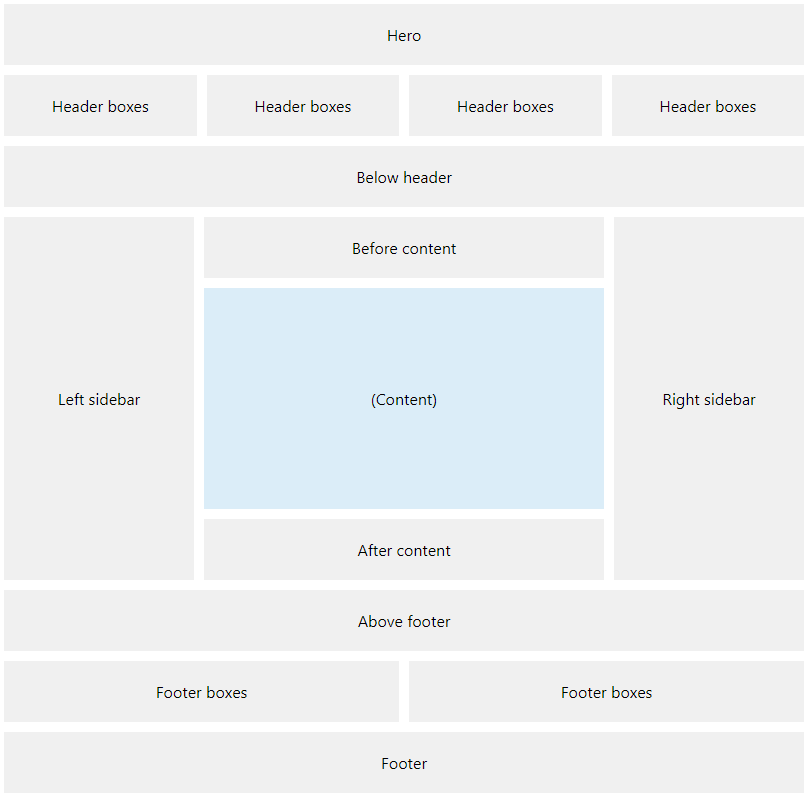

# Box Package Installation Plugin

Deploy and manage boxes that can be placed anywhere on the site, they come in two flavors: system and content-based.

## Components

Each item is described as a `<box>` element with the mandatory attribute `name` that should follow the naming pattern `<packageIdentifier>.<BoxName>`, e.g. `com.woltlab.wcf.RecentActivity`.

### `<name>`

!!! info "The `language` attribute is required and should specify the [ISO-639-1](https://en.wikipedia.org/wiki/ISO_639-1) language code."

The internal name displayed in the admin panel only, can be fully customized by the administrator and is immutable. Only one value is accepted and will be picked based on the site's default language, but you can provide localized values by including multiple `<name>` elements.

### `<boxType>`

#### `system`

The special `system` type is reserved for boxes that pull their properties and content from a registered PHP class. Requires the `<objectType>` element.

#### `html`, `text` or `tpl`

Provide arbitrary content, requires the `<content>` element.

### `<objectType>`

Required for boxes with `boxType = system`, must be registered through [the objectType PIP](object-type.md) for the definition `com.woltlab.wcf.boxController`.

### `<position>`

The default display position of this box, can be any of the following:

* bottom
* contentBottom
* contentTop
* footer
* footerBoxes
* headerBoxes
* hero
* sidebarLeft
* sidebarRight
* top

#### Placeholder Positions

### `<showHeader>`

Setting this to `0` will suppress display of the box title, useful for boxes containing advertisements or similar. Defaults to `1`.

### `<visibleEverywhere>`

Controls the display on all pages (`1`) or none (`0`), can be used in conjunction with `<visibilityExceptions>`.

### `<visibilityExceptions>`

Inverts the `<visibleEverywhere>` setting for the listed pages only.

### `<cssClassName>`

Provide a custom CSS class name that is added to the menu container, allowing further customization of the menu's appearance.

### `<content>`

!!! info "The `language` attribute is required and should specify the [ISO-639-1](https://en.wikipedia.org/wiki/ISO_639-1) language code."

#### `<title>`

The title element is required and controls the box title shown to the end users.

#### `<content>`

The content that should be used to populate the box, only used and required if the `boxType` equals `text`, `html` and `tpl`.

## Example

{jinja{ codebox(
  title="box.xml",
  language="xml",
  filepath="package/pip/box.xml"
) }}
